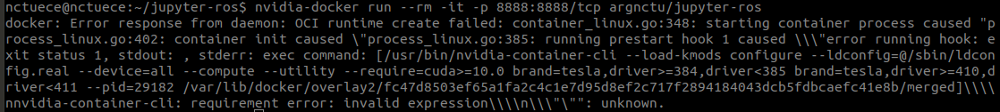

# arg-jupyter-ros
arg-jupyter-ros is forked from https://github.com/RoboStack/jupyter-ros

As described in https://blog.jupyter.org/ros-jupyter-b7e82b5e1202, we found the following in particular useful.
* Works with any web browser — not bound to Linux, and no Qt applications need to be compiled.
* Doesn’t need to run locally! Applications can run on a server far away, without any manual setup or installation procedure.

## 0. Goals

Those great features tackle the challenges we have encountered over the years.
* For education we need to create VirtualBox images installed with ROS for our students. 
* For virtual competition like VRX, we need to setup monitors in front of the ROS-enabled desktops for students due to the limitation of visualization over ssh, instead of remote developments.
* For research we have large ROS bags collected in experiments or competitions, and there was no good ways to analyze them properly. The ROS bags may lie down in the unlimited Google drive forever.

Therefore, our goals are as follows:

### A. Dockerize jupytor-ros in CPU and GPU (DONE)

### B. Enable live diagnosis the states (pose, features, etc) on a real or simulated robot.

ROS master is always on the real robot, which is ideal when the network connection is unstable between the robot and the laptop. Nevertheless, jupyter-ros is good at visualize 3D data, but still limited for image topics (also about network bandwidth).

Use Cases
* Introduction to AI course (A* planning real robot tutorial)
* Visualize how the simulated WAM-V perform from VRX

### C. Analyze large ROS bags on a server

Use Cases
* Many ROS bags may be as large as several GB, which is infeasible to read/analyze on a local machine (e.g., Mac). Now we could store all ROS bags on workstation, and analyze them at local machine.
* The process of data analysis was usually not easy to replicated, making it hard to reproduce research results. Now jupyter-ros makes it easier.

## 1. Install and Run jupyter-ros via Docker

### 1.1 CPU:

#### Build docker 

```bash
    $ cd docker/cpu
    $ docker build -t argnctu/jupyter-ros .      # It takes about 40-60 mins
``` 

#### Pull docker image from Dockerhub 
```bash
    $ docker pull argnctu/jupyter-ros    # It takes about 20 mins (depend on you network bandwith)
``` 

#### Run
The docker container can be run on your local machine or on a remote workstation.

Linux
```bash
    $ docker run --rm -it -p 8888:8888/tcp --name jupyter-ros-container -v /home/[username]:/hosthome argnctu/jupyter-ros
```

Mac
```bash
    $ docker run --rm -it -p 8888:8888/tcp --name jupyter-ros-container -v /Users/[username]:/hosthome argnctu/jupyter-ros
```

### 1.2 GPU

#### Build docker 

```bash
    $ cd docker/gpu
    $ docker build -t argnctu/jupyter-ros:gpu .      # It takes about 40-60 mins
``` 

#### Pull docker image from Dockerhub 

If your nvidia-driver [version >= 410.48](https://docs.nvidia.com/deploy/cuda-compatibility/index.html#binary-compatibility__table-toolkit-driver):
```bash
    $ docker pull argnctu/jupyter-ros:gpu
```

#### Run Docker with CUDA support (assume you have installed [nvidia-docker](https://github.com/NVIDIA/nvidia-docker))

Linux
```bash
    $ nvidia-docker run --rm -it -p 8888:8888/tcp --name jupyter-ros-container -v /home/[username]:/hosthome argnctu/jupyter-ros:gpu
    
    # or use new nvidia-docker command:
    # docker run --gpus all --rm -it -p 8888:8888/tcp --name jupyter-ros-container -v /home/[username]:/hosthome argnctu/jupyter-ros:gpu
```

---
## 2. Start jupyter-ros (both GPU and CPU)
In the container:

```bash
    # cd /root/jupyter-ros
    $ jupyter notebook --ip=0.0.0.0 --port=8888 --allow-root
```
On your local machine:

    Open web browser and input the token to: 
    127.0.0.1:8888

## 3. Basic Usage CPU

You could directly run the exampe in:
* notebooks/ROS 3D Grid.ipynb 

### 3.1 Use jupyter-ros with a ROS bag

By default we have add the volumn linked:
* ~/ locally (at workstation)
* /hosthome in docker container

Also we have named our container as --name jupyter-ros-container. We could then use the following command to run inside the container. 
```bash
$ docker exec -it jupyter-ros-container <commands>
```

#### Get some open ROS bags

We suggest the MIT Stata Dataset (https://projects.csail.mit.edu/stata/downloads.php).

```bash
    $ cd /hosthome/arg-rosbags/stata
    $ wget http://infinity.csail.mit.edu/data/2011/2011-01-25-06-29-26.bag
```

Or the SubT STIX ROS bags
```bash
    $ cd /hosthome/arg-rosbags/subt/smoke_test
    $ wget https://subt-data.s3.amazonaws.com/smoke_test/subt_edgar_hires_2019-04-12-15-52-44.bag
```

#### Play a ROS bag and publish topics

Inside the container "jupyter-ros-container" our bags could be accessed at /hosthome/arg-rosbags.
Let's use byobu to run rosplay.

* Terminal 1 has been running container

* Termain 2:
Need to run the launch file to enable websocket
```bash
    $ docker exec -it jupyter-ros-container bash
```
Inside container
```bash
    # cd /root/jupyter-ros/notebooks/launch/
    # roslaunch bridge.launch
```

* Terminal 3:
```bash
    $ docker exec -it jupyter-ros-container bash
```
Inside container
```bash
    # rosbag play -l /hosthome/arg-rosbags/stata/2011-01-25-06-29-26.bag
    or
    # rosbag play -l /hosthome/arg-rosbags/subt/main_loop/subt_edgar_hires_2019-04-11-13-31-25.bag
```
SubT log is 70G and will take a ~20 seconds to start.

* Terminal 4:
```bash
    $ docker exec -it jupyter-ros-container bash
```
Inside container
```bash
    # rostopic list 
```

Try to run it at jupyter notebook


#### Run notebooks/ROS Laser Scan.ipynb


## 4. Basic Usage GPU

Verify your cuda-support function: type python to enter python-shell, then type:
```python
import torch
print(torch.cuda.is_available())  # It will return True if installation is successful
exit()
```

Enjoy!

## Troubleshooting

#### Failed to docker run  (case 1)

Please re-checked your nvidia driver by typing "nvidia-smi", then choose correct tag of the docker image.


#### Failed to display Jupyter
If you got the following error when you run a cell ```failed to display Jupyter Widget of type VBox```, 
you can solve it by running the following command ```jupyter nbextension enable --py --sys-prefix widgetsnbextension```
