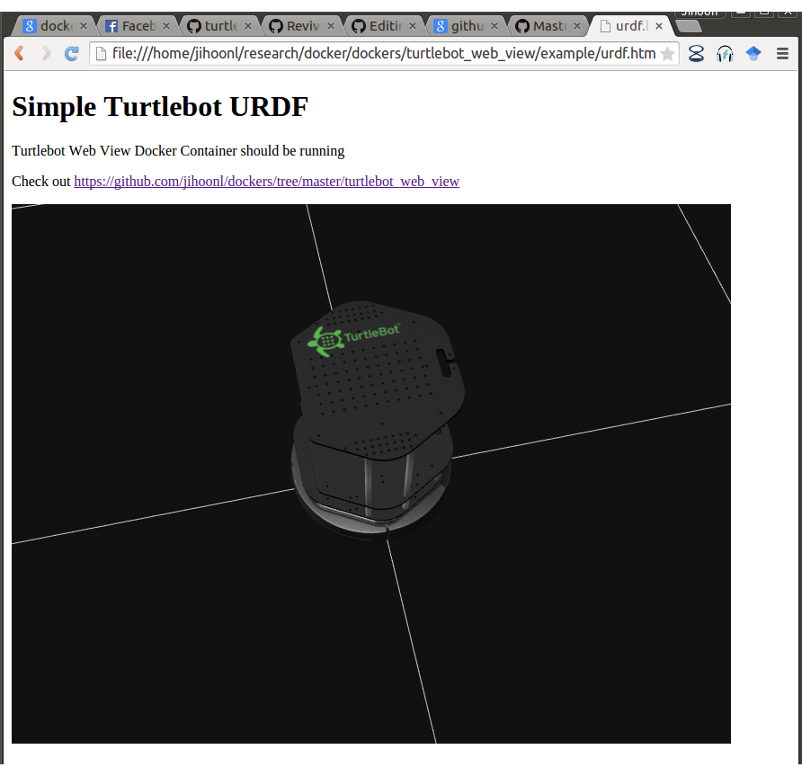

# Robot Web Tools Demo Docker 


## build 

```
    $ docker build -t argnctu/rwt-demo .
```

## Execution

* Starts Docker Container. Rsbridge port will be exposed as localhost:8888
```
 > docker run -d -p 8888:9090 argnctu/rwt-demo 
```

* Open demo page. (Turtlebot2 URDF, Marker, Interactive Marker demo are supported)

</img>


## Customise 

1. Edit [Dockerfile](Dockerfile) and image name in [build_environment.sh](build_environment.sh)

2. Create image 

```
  ./build_environment.sh
```
